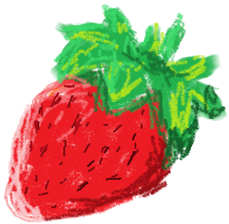

<div align="center">

</div>

# Strawberry Lang

### Strawberry CLI

TO-DO

### Strawberry Syntax

Basic write to console:

```strawberry
strawberry("Hello World")

strawberry("Hello " + 10) 🍓 This will print "Hello 10"
strawberry(15 + 10) 🍓 This will print 25 
strawberry("Hello " + "World!") 🍓 This will print "Hello World!"

🍓 this is a comment
```

### Strawberry Arithmetic

| Operator  | Use   |
|-------------- | -------------- |
| +    | Strings and numbers. (Ex: 2 + 4 = 6)     |
| -    | Numbers. (Ex: 3 - 2 = 1)     |
| *    | Numbers. (Ex: 2 * 2 = 4)     |
| /    | Numbers, Int division. (Ex: 4 * 2 = 0)     |
| %    | Numbers. (Ex: 4 % 2 = 0)     |

